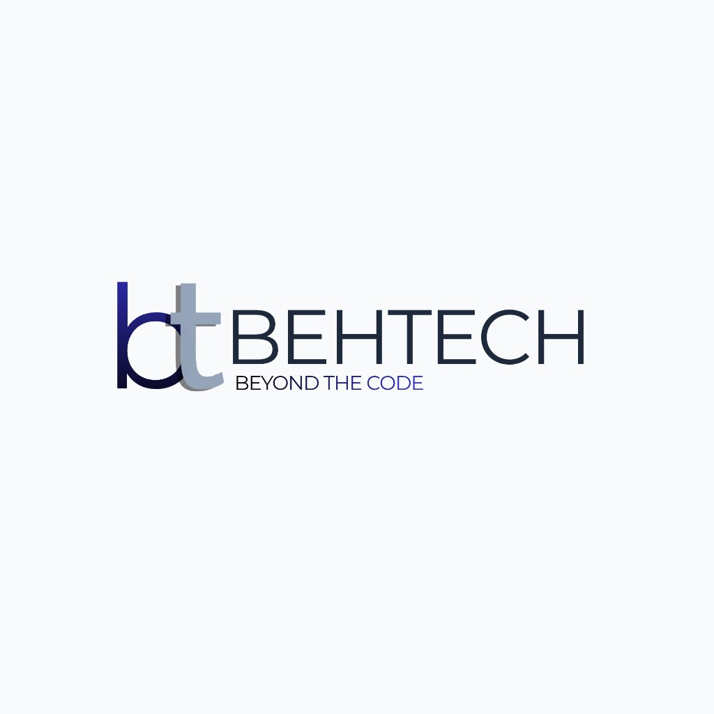

# 👋 Hi, I'm Behlul

🎓 Electrical & Electronics Engineering student at Sakarya University of Applied Sciences

💻 **AI & Software Developer | Founder @ BehTech**

I build **AI-powered software, SaaS products, business automation systems, and scalable web applications** focused on solving real-world business problems.

🚀 **Founder of BehTech**, where we develop digital solutions for service-based businesses, including **barbers, beauty salons, tattoo studios, and other appointment-driven businesses.**

### 🏢 BehTech

At **BehTech**, we're building modern business software that helps businesses manage and grow their operations.

Our products include:

* 📅 **Appointment & Booking Systems** — Smart scheduling and reservation management
* 📊 **CRM Systems** — Customer, lead, sales, and pipeline management
* ⚙️ **Business Automation** — WhatsApp, SMS, notifications, and automated workflows
* 📈 **Admin Dashboards** — Business analytics, revenue tracking, staff and service management
* 🤖 **AI-Powered Solutions** — AI agents, chatbots, RAG systems, and intelligent automation

### 🧠 What I Work With

**AI & Machine Learning**
Python · PyTorch · TensorFlow · OpenCV · YOLO · LangChain · RAG · AI Agents

**Backend & Web**
Python · Flask · FastAPI · JavaScript · Node.js · REST APIs

**Databases & Infrastructure**
PostgreSQL · MySQL · Supabase · Docker · Nginx · Cloudflare

**Development Tools**
Git · GitHub · Linux · Arduino

### 🚀 Featured Projects

* 🏢 **BehTech — Business Management & SaaS Solutions**
* 📅 Appointment & Booking Platforms for Barbers, Beauty Salons & Tattoo Studios
* 📊 CRM & Sales Management Systems
* 🤖 AI-powered WhatsApp Chatbots
* 🧠 RAG-based AI Applications
* 🚗 TEKNOFEST RoboLig & Air Defense Systems
* 🐾 AI-powered Veterinary System

🌱 Currently exploring **AI Agents, intelligent automation, SaaS architecture, and scalable business software.**

📫 **Let's connect:**
[LinkedIn](https://www.linkedin.com/in/muhammed-behl%C3%BCl-alar-b7ba2b297/) · [UpWork](https://www.upwork.com/freelancers/~01ba2347ffe87e117d?mp_source=share)

  

